# Analisi Comparativa Quantitativa e Qualitativa: Dataset Sintetico Ibrido LLM (Francesca Verdi) vs Dataset Reali (CASAS Smart Home)

---

## 1. Sintesi del Dataset Sintetico Analizzato (`export_bd945d7dadfe4943.zip`)

Il pacchetto analizzato contiene l'esportazione completa di una simulazione ibrida guidata da LLM (*Smart Home Simulator*) incentrata sul residente singolo **Francesca Verdi**, coprendo un orizzonte temporale di **91 giorni consecutivi** (dal 24 luglio 2026 al 23 ottobre 2026).

### Statistiche Generali della Simulazione

| Metrica / Dimensione | Valore Sintetico (Francesca Verdi) | Note / Struttura |
| :--- | :--- | :--- |
| **Durata Simulazione** | 91 giorni | Dal 24/07/2026 al 23/10/2026 |
| **Attività di Alto Livello** | **945** istanze | Macro-intenti (es. `wake_up`, `eat_breakfast`, `read_and_rest`, `sleep`) |
| **Azioni Elementari (Micro-Azioni)** | **3.997** istanze | Step operativi (`move_to_capability`, `change_posture`, `take_item`, `consume`) |
| **Spostamenti nello Spazio** | **1.419** eventi | Transizioni tra stanze/zone |
| **Transizioni di Stato Fisico** | **6.925** transizioni | Tracciamento postura, posizione 2D/zona, stato oggetti (`consumed`, `open`, `carrying`) |
| **Deviazioni dal Piano** | **57** eventi | Riancoraggi e riparazioni locali del piano (`shifted_by_local_repair`) |
| **Eventi Sensoriali Osservabili** | **124.983** letture | Flusso osservabile dai sensori (`pir`, `temperature`, `contact`) |
| **Qualità dei Dati Sensoriali** | 72.261 `nominal`, 52.722 `noisy` | Modellazione esplicita del rumore sensoriale |
| **Formati di Esportazione** | CSV, JSONL, XES (IEEE 1849) | Supporto nativo per Process Mining e ML |
| **Separazione Osservabile / Oracle** | **Disponibile** (`observable` vs `oracle`) | Mappatura causa-effetto esplicita tra sensore e azione/attività |

---

## 2. Paragone Quantitativo ed Informazionale

Rispetto ai benchmark reali per Smart Home di riferimento (in particolare **CASAS Aruba** e **CASAS Kyoto**):

```mermaid
graph TD
    subgraph Dataset Reale (es. CASAS Aruba)
        A1[Eventi Sensoriali Raw] --> A2[Etichette Umane Coarse]
        A2 -->|Incertezza / Noise| A3[Mancanza di Micro-azioni e Posizione]
    end

    subgraph Dataset Sintetico Ibrido LLM (Francesca Verdi)
        B1[Flusso Osservabile: PIR, Temp, Door] --> B2[Oracle Trace Causale]
        B2 --> B3[Micro-Azioni: take_item, change_posture]
        B2 --> B4[Transizioni Stato: Posizione, Oggetti, Postura]
        B2 --> B5[Macro-Attività: wake_up, eat_breakfast, sleep]
        B2 --> B6[Riparazioni e Deviazioni di Piano]
    end
```

### A. Livelli di Astrazione e Granularità della Ground Truth

1. **Dataset Reali (es. CASAS Aruba)**:
   - **Annotazione Parziale e Coarse**: Le etichette di attività (`Sleeping`, `Meal_Preparation`, `Relax`) sono apposte manualmente dai residenti tramite pulsanti o da annotatori esterni ex-post.
   - **Vasi Vuoti (Unlabeled Time)**: Ampi tratti di segnali sensoriali non sono associati ad alcuna attività etichettata.
   - **Assenza di Micro-Azioni**: Nessuna visibilità su cosa stia facendo nello specifico l'utente durante la preparazione del pasto (es. se sta aprendo il frigo, prendendo un piatto, mescolando o sedendosi).
   - **Nessun Tracciamento dello Stato Fisico**: Non existe traccia esplicita di quali oggetti siano stati spostati o consumati, né della postura del residente.

2. **Dataset Sintetico Ibrido LLM (Francesca Verdi)**:
   - **Ground Truth Completo a 5 Livelli**:
     1. *Macro-Attività* (945 istanze, es. `eat_breakfast`, durate medio-lunghe).
     2. *Micro-Azioni* (3.997 istanze, es. `move_to_capability`, `change_posture`, `take_item`).
     3. *Movimenti e Posizione* (1.419 transizioni spaziali).
     4. *Stato dell'Ambiente e degli Oggetti* (6.925 transizioni di stato precise, es. `refrigerator_01.prepared_meal.consumed`).
     5. *Audit delle Deviazioni* (57 log di rinvio/riparazione del piano per indisponibilità dell'attore).
   - **Mappatura Causale Oracle**: Ogni osservazione sensoriale nel file `oracle.csv`/`oracle.jsonl` contiene i puntatori espliciti (`causeId`, `activityExecutionIds`, `actionExecutionIds`), risolvendo completamente l'ambiguità causale.

---

## 3. Focus Dettagliato: Confronto del Flusso Osservabile Puro (Senza Oracle)

Se consideriamo unicamente il **flusso grezzo dei sensori** (`observable.csv`), eliminando qualsiasi livello di ground truth/oracle, emergono differenze strutturali chiave tra il segnale sintetico e il segnale reale di laboratorio.

### A. Metriche Quantitative a Confronto Diretto

| Metrica Sensoriale (Solo Raw Log) | Dataset Sintetico (Francesca Verdi) | Dataset Reale (CASAS Aruba) | Differenza & Significato Fisico |
| :--- | :--- | :--- | :--- |
| **Volume Eventi Giornaliero** | **~1.355 eventi / giorno** (124.983 totali / 92 gg) | **~7.816 eventi / giorno** (1.719.558 totali / 220 gg) | Aruba è **~5.8 volte più denso** a causa della densità dei PIR a soffitto. |
| **Sensori Attivi** | 12 sensori (5 PIR, 5 Temp, 2 Contatti) | 40 sensori (31 PIR, 5 Temp, 4 Porte) | Aruba copre una maglia spaziale a griglia micro-locale. |
| **Inter-Event Time Delta (Mediana)** | **9.32 secondi** | **1.51 secondi** | In Aruba l'attività sensoriale avviene con raffiche quasi continue. |
| **Burstiness / Jitter (< 1s)** | **9.32%** degli eventi (7.37% a t=0) | **37.01%** degli eventi | Nel reale, 1 evento su 3 scatta a <1s (chattering dei sensori). |
| **Simmetria Eventi Binari** | **100% Simmetrico** (es. Frigo: 74 OPEN, 74 CLOSED) | **Asimmetrico / Impreciso** (Packet loss, ritardi di reset) | Il sintetico chiude sempre formalmente gli stati binari. |

```mermaid
gantt
    title Profilo Frequenza di Scatto dei Sensori (Inter-Event Delta)
    dateFormat X
    axisFormat %s

    section Sintetico (Francesca Verdi)
    Evento PIR Zone (ON) :active, 0, 1
    Pausa movimento : 1, 10
    Evento PIR Zone (OFF) : 10, 11
    Sincronizzazione Temp (t=0) : 10, 10

    section Reale (CASAS Aruba)
    M009 (Scatto 1) :active, 0, 1
    M009 (Scatto 2 - 0.2s) :active, 1, 2
    M009 (Scatto 3 - 0.5s) :active, 2, 3
    M019 (PIR adiacente - 0.8s) :active, 3, 4
```



---

### B. Analisi delle Differenze nel Flusso Osservabile

#### 1. Densità Spaziale e Topologia dei PIR
- **Francesca Verdi (Zona-Based)**: L'installazione della casa simulata è basata su **macro-zone** (`kitchen`, `bathroom`, `living_room`, `bedroom`, `balcony`). Un PIR di zona si attiva (`ON`) quando il residente entra ed esegue un'azione e si disattiva (`OFF`) all'uscita o al termine dell'occupazione.
- **CASAS Aruba (Micro-Grid Based)**: Utilizza **31 sensori PIR** distribuiti ogni 1-2 metri. Camminare dall'ingresso alla cucina genera una scia di 10-15 PIR distinti (`M001` $\rightarrow$ `M002` $\rightarrow$ `M003` $\rightarrow$ `M004`...). La matrice delle transizioni di Aruba mostra infatti che il sensore `M009` scatta consecutivamente su se stesso **194.729 volte** (self-loop dovuto al ridondante sovracampionamento).

#### 2. Dinamica Temporale e Fenomeno del "Sensor Jitter / Chattering"
- **Dataset Reale (CASAS Aruba)**: Il **37.01%** degli eventi sensoriali ha un intervallo inferiore al secondo. Quando l'umano si muove, oscilla le braccia o sposta il busto, il sensore PIR hardware invia multipli impulsi impulsivi ravvicinati.
- **Dataset Sintetico**: Solo il **9.32%** degli eventi ha un intervallo $<1$s, e di questi il **7.37%** ha esattamente lo stesso timestamp (`delta = 0`). Quest'ultimo fenomeno non è chatter sensoriale, ma l'emissione simultanea nello stesso tick di simulazione di una lettura di temperatura ambient e di un cambio stato PIR.

#### 3. Integrità e Coerenza dei Sensori Binari (Contatti Magnetici / Porta)
- **Dataset Sintetico**: I contatti magnetici (es. `contact_refrigerator_01` e `contact_medication_cabinet_01`) presentano un bilanciamento perfetto tra `OPEN` e `CLOSED` (74 vs 74 e 28 vs 28). Non esistono stati "incompleti" o "porte rimaste aperte indebitamente" se non espressamente pianificate.
- **Dataset Reale**: Nei dataset reali è frequente osservare eventi di apertura senza la corrispondente chiusura (a causa di perdita di pacchetti radio Zigbee/Z-Wave, interferenze o malfunzionamenti magnetici).

#### 4. Sensori Continui vs Event-Driven (Temperatura)
- **Francesca Verdi**: I sensori di temperatura emettono 52.358 letture regolari (circa 113 letture/giorno per ciascuna delle 5 stanze). Ciascuna lettura reca il flag `quality: noisy` oppure `quality: nominal`, dove il rumore è generato da un modello stocastico gaussianizzato (fluttuazioni controllate attorno al valore fisico di stato).
- **CASAS Aruba**: I sensori di temperatura scattano **solo quando la temperatura varia di almeno 0.5 °C** (event-driven threshold sampling), producendo serie temporali irregolari (es. nessun evento per ore durante la notte, poi raffiche di variazioni durante il giorno).

---

### C. Implicazioni per gli Algoritmi di Machine Learning (Senza Oracle)

Quando un algoritmo viene addestrato **esclusivamente sul flusso osservabile puro** (senza accedere a etichette, azioni o oracle):

1. **Unsupervised Activity Discovery & Clusterization**:
   - *Sintetico*: Molto più agevole da segmentare. La pulizia delle sequenze di zona (es. `pir_kitchen` $\rightarrow$ `contact_refrigerator` $\rightarrow$ `pir_kitchen`) e l'assenza di chattering permettono ad algoritmi come K-Means temporali o LDA (Latent Dirichlet Allocation) di individuare subito i pattern di attività.
   - *Reale*: Richiede una pesante fase di **Debouncing** e **Sliding Window Aggregation** per unificare raffiche di micro-eventi PIR sotto un'unica finestra temporale.

2. **Sequential Pattern Mining (es. PrefixSpan, SPADE)**:
   - *Sintetico*: Estrae sequenze pulite e deterministiche di transizione da stanza a stanza.
   - *Reale*: I pattern sequenziali sono inizialmente dominati da self-loop (`M009` $\rightarrow$ `M009`), rendendo obbligatoria la rimozione dei duplicati consecutivi.

3. **Rischio di "Sim-to-Real Gap"**:
   - Un modello di Activity Recognition (es. LSTM/Transformer) addestrato **solo** sul flusso osservabile sintetico puro otterrà metriche di accuratezza sintetiche molto alte, ma potrebbe risentire dell'elevata frequenza di jitter sensoriale e delle disconnessioni hardware quando distribuito su una vera abitazione fisica.

---

## 4. Paragone Qualitativo Generale (Comportamento e Fisica)

### A. Comportamento del Residente: Realismo LLM vs Umanità Reale

| Dimensione Comportamentale | Dataset Reale (Umano) | Dataset Sintetico Ibrido (LLM Agent) |
| :--- | :--- | :--- |
| **Routine Domestiche** | Elevata variabilità stocastica, condizionata da stanchezza, umore, meteo ed eventi imprevisti. | **Ottima struttura semantica**: Francesca Verdi segue routine realistiche (sveglia $\rightarrow$ igiene $\rightarrow$ colazione $\rightarrow$ pulizie/riposo $\rightarrow$ pranzo $\rightarrow$ svago $\rightarrow$ cena $\rightarrow$ igiene serale $\rightarrow$ sonno). |
| **Durata delle Attività** | Distribuzione a coda lunga con forte variabilità (es. pranzo da 10 a 60 min). | **Distribuzioni controllate**: Durate ben definite (es. `sleep` fisso a 420 min, `eat_breakfast` medio 29.8 min, `read_and_rest` 44.8 min). Meno varianza estrema rispetto all'umano reale. |
| **Deviazioni e Interruzioni** | Umane, estemporanee e irrazionali (dimenticarsi oggetti, cambiare idea, multitasking disordinato). | **Deviazioni logiche guidate dal planner**: 57 riparazioni di piano (`shifted_by_local_repair`) per gestione dei vincoli. Estremamente coerenti, ma prive di irrazionalità pura. |
| **Micro-Movimenti e Parassiti** | Frequenti (camminare avanti e indietro, esitazioni spaziali, soste intermedie). | Movimenti efficienti e finalizzati ai punti di interesse (capability points). |

---

## 5. Conclusioni e Raccomandazioni per la Tesi

Il dataset di **Francesca Verdi (91 giorni)** rappresenta un **eccellente benchmark ibrido**:
- Unisce la **ricchezza semantica dell'LLM** alla **rigidità formale del simulatore a eventi discreti**.
- **Sul piano del flusso osservabile puro**: Risulta più pulito, strutturato a zone e privo del micro-chattering estremo dei sensori hardware reali, facilitando il test e la comprensione dei modelli baseline.
- Si raccomanda di utilizzare il dataset sintetico per l'addestramento e la validazione formale di algoritmi di **Activity Recognition, Process Mining e Anomaly Detection**, riservando i dataset reali (CASAS) come testbed finale per la verifica della robustezza rispetto al rumore hardware non modellato.
